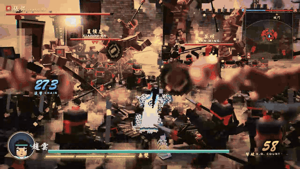
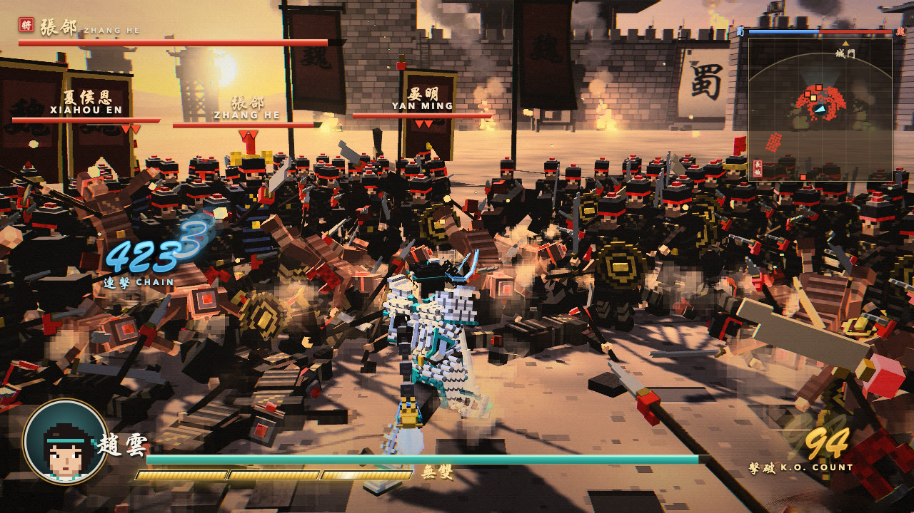
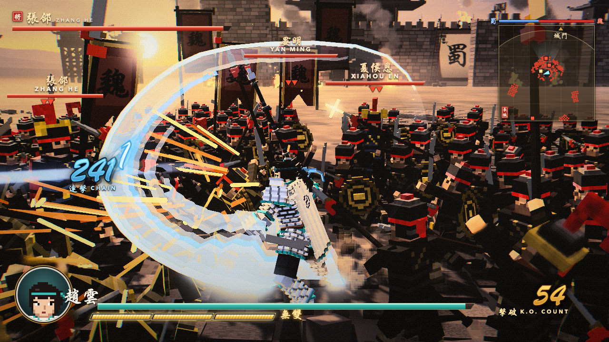
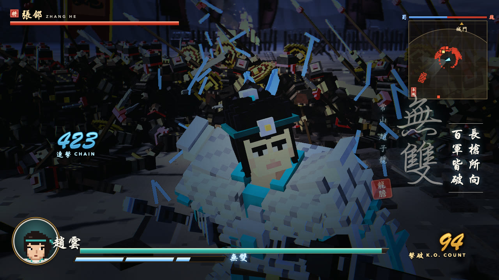
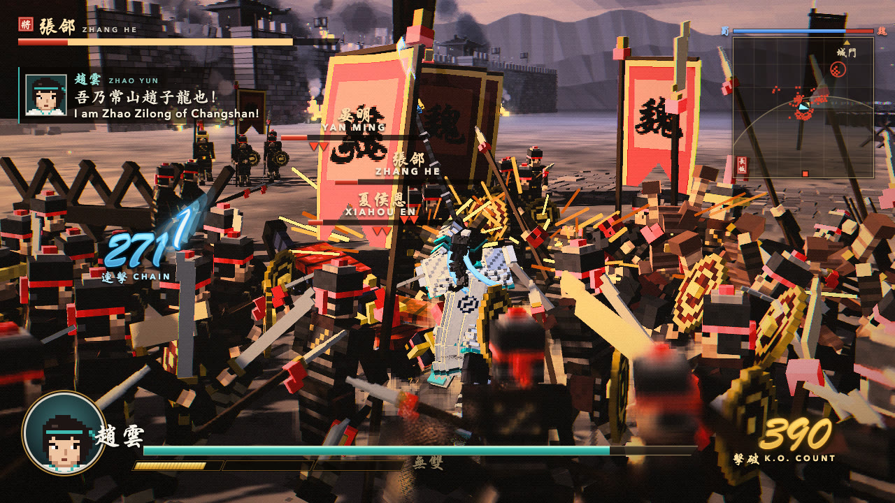
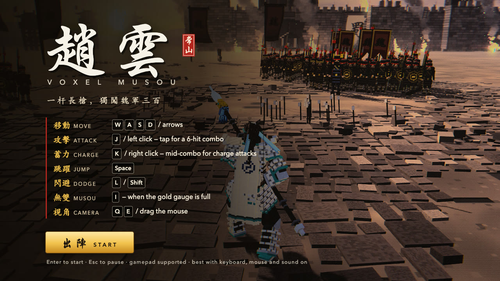

[English](README.md) | **简体中文** | [日本語](README.ja.md)

# Voxel Musou — 赵云（趙雲）

<p align="center">
  <a href="https://voxel-musou.vercel.app"></a>
</p>

<p align="center"><b><a href="https://voxel-musou.vercel.app">▶ 在浏览器中游玩 — voxel-musou.vercel.app</a></b></p>

| | |
| --- | --- |
|  |  |
| 大规模混战，400+ 连击 | 蓄力横扫 |
|  |  |
| 无双演出 | 无双神龙，击破 150 人 |

一款可在浏览器中直接游玩的体素风动作游戏，玩法致敬《真·三国无双》，基于 Three.js 开发。它最初只是“赵云单骑对阵约 300 名魏军”的演示，现已发展成 **四阵营的指挥官玩法**：率领一员大将与一支军队，守住己方旗杆、抢占中央旗，并砍倒对手的军旗——可以对战电脑，也可以邀请最多 3 位好友。

无需构建：纯 ES 模块，Three.js r186 已内置于 `vendor/three/`，逻辑以固定 60 Hz 确定性步进运行。

## 游戏模式

| 模式 | 说明 |
| --- | --- |
| **好友房间** | 创建房间（6 位数字代码）或输入代码加入，最多 4 人。按顺序选择阵营（每人 10 秒），再选择武将（15 秒）。由其中一位玩家的浏览器运行模拟，一台小型中继服务器（`server/`）负责连接所有人。 |
| **人机对战（PvE）** | 你 + 1–3 名电脑对手，电脑会从剩余阵营和武将中随机选择。简单 / 普通 / 困难（反应时间 1.0 / 0.5 / 0.25 秒，收入 ×0.8 / ×1.0 / ×1.2）。 |
| **单人练习** | 与一名原地不动的敌将打一整局——适合试用商店、号令和旗杆。 |
| **无双演示（经典）** | 最初的单骑演示：赵云对阵大批魏军。 |

### 规则简述

- 一局 **15 分钟**。每位玩家拥有一根 **旗杆**（1 500 HP），旗杆被砍倒即出局；**砍倒所有对手的旗杆即刻获胜**（每砍倒一根奖励 1 000 金）。时间耗尽时，**累计赚取金币最多** 的玩家获胜（分数相同为平局）。
- **中央旗**：在 4 米范围内不受干扰地站满 5 秒即可夺取，持有者的收入 **×1.5**。
- 收入为每秒 10 金（初始 300 金）。在 **商店**（`B` 键）中消费：单个兵种（枪兵 / 刀盾兵 / 弓手，50 金）、**小队组合**（13 名士兵，500 金）、最多 8 名盾枪 **守旗兵**、以及 **升级**（2–3 级，300 / 600 金）。机动兵力上限 60。克制关系：枪 > 弓 > 刀盾 > 枪（伤害 ×1.5）。
- 用四种 **号令** 指挥军队：跟随、防守、进攻、撤退（`1`–`4`）。
- 大将阵亡后，其随从消失，但守旗兵、金币和升级保留；10 秒后携带一名中队长与一名旗手重生。等待期间购买的士兵会在重生时出现。

## 特色

- 经典动作：流畅的普通连招（N1–N6）与蓄力攻击（C1–C6）、打击停顿与命中特效
- 四大阵营（曹魏、蜀汉、东吴、义军），各有配色与旗帜，共 20 名武将可选（目前只有赵云拥有专属模型与招式，其余暂借用他的）
- 体素士兵军队（InstancedMesh）：阵型、索敌、兵种克制与四种号令
- 经济、商店与升级；旗杆、中央旗、重生、小地图与结算画面
- 电脑对手（会花钱、下号令的指挥官 + 带简单状态机的武将）
- 最多 4 人的在线房间（主机权威、每秒 20 次快照、60 秒内可重连）
- 越南语与英语界面（在标题画面切换）
- 黄昏时分的城池战场、自定义后处理（雾霭、景深、泛光、复古像素风）、程序化生成的 WebAudio 音效、书法风格 HUD

## 运行

ES 模块无法通过 `file://` 加载，请用任意静态服务器托管此目录：

```sh
python3 -m http.server 8000
```

然后打开 http://localhost:8000 。需要支持 WebGL2 的浏览器，推荐使用独立显卡的桌面电脑。首次按键或点击后开始播放声音。

### 在线房间（可选）

房间功能需要中继服务器（Node.js 18+，唯一依赖是 `ws`）。它还会引用 `src/` 中的共享配置，因此请在仓库根目录运行：

```sh
npm install --prefix server
npm run server          # 监听 :8787，GET /health → ok
```

从 `localhost` 打开页面时会自动连接 `ws://localhost:8787`。若使用已部署的服务器，请在网址后加 `?server=wss://你的服务器`（或修改 `src/net/client.js` 中的 `DEFAULT_SERVER_URL`）。部署说明与 Render 配置见 [`server/DEPLOY.md`](server/DEPLOY.md)、[`render.yaml`](render.yaml)。房主的浏览器标签页必须保持在前台——被限速的后台标签页会拖慢整个房间。

### 测试

```sh
npm test
```

运行 Node 测试（规则、经济、军队、AI、网络协议、房间、多语言）。WebSocket 测试使用 Node 内置的 `WebSocket`，建议使用 Node 22+。

## 操作

键盘加鼠标，也可使用手柄。

| 动作 | 按键 |
| --- | --- |
| 移动（相对镜头方向） | WASD / 方向键 |
| 普通攻击 | J / 鼠标左键（连按 3 次 J，第 3 次自动变为蓄力攻击） |
| 蓄力攻击 | K / 鼠标右键 |
| 镜头旋转 | 鼠标拖动 / Q E |
| 回血药 | R（5 瓶，每瓶恢复最大生命的 30%；用完后回到自己的旗杆——或己方占领的中央旗——即可补满） |
| 号令：跟随 / 防守 / 进攻 / 撤退 | 1 / 2 / 3 / 4（手柄十字键） |
| 商店 | B（对局不会暂停） |
| 暂停 / 菜单 | Esc（在线对局中游戏不会暂停） |
| 开始 | Enter / 点击 出陣 |

现在只保留 J 和 K 两个攻击键；所有武将的跳跃、闪避、无双技能均已关闭（在 `src/hero/controls.js` 中统一过滤输入）。



## 选项

| URL 参数 | 说明 |
| --- | --- |
| `?enemies=N` | 无双演示中的敌兵数量，0–2000（默认 300） |
| `?server=wss://…` | 房间服务器地址（在 localhost 上默认为 `ws://localhost:8787`） |
| `?mode=sandbox` | 直接进入“单人练习”对局 |
| `?gold=N`、`?nodef=1`、`?flaghp=N` | 对局测试参数：初始金币、去掉敌方守军、旗杆 HP |
| `?debug=1`、`?norender=1` | 开发者接口（`window.__game`、`__ff(n)`）；跳过绘制，使模拟在无 GPU 时全速运行 |

## 项目结构

```
index.html      入口、importmap、HUD CSS
src/            core、hero、combat、crowd、musou、camera、vfx、post、world、audio、ui
                army/ match/ ai/ net/ i18n/ config/ data/   （指挥官玩法：兵种、规则、AI、联网、文案、数值）
server/         房间 / 大厅 / 中继服务器（Node + ws），单独部署
tests/          node --test 测试集
vendor/three/   Three.js r186
media/          README 截图与 GIF
```

## 致谢与许可

- 代码：MIT 许可，见 [LICENSE](LICENSE)。
- [three.js](https://threejs.org/)：MIT 许可。
- HUD 备用字体 `src/ui/brush.woff2` 是 Yuji Boku（Kinuta Font Factory）的子集，采用 SIL Open Font License 1.1 授权。
- `src/ui/fonts/` 中的界面字体：[Noto Serif](https://fonts.google.com/noto/specimen/Noto+Serif) 与 [Be Vietnam Pro](https://fonts.google.com/specimen/Be+Vietnam+Pro)，均采用 SIL Open Font License 1.1（附许可文本）。

本项目为同人作品，与 KOEI TECMO 无关，也未获其认可。“Dynasty Warriors”（真·三国无双）是 KOEI TECMO 的商标。本项目不包含任何原作游戏素材。
